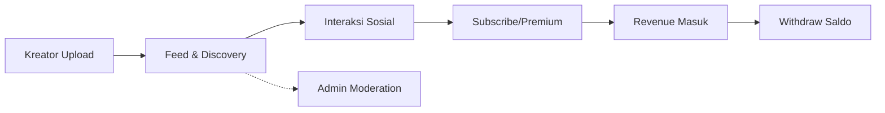

<p align="center">
  
</p>

<p align="center">
  <strong>Platform Berbagi Foto, Membangun Audiens, & Monetisasi Karya Digital</strong>
</p>

<p align="center">
  
  
  
  
  
</p>

---

## 📖 Deskripsi Proyek

**Motret V2** adalah evolusi dari platform berbagi foto yang menggabungkan konsep *Media Sosial* dengan *Marketplace Karya Digital*. Dirancang untuk memberikan pengalaman pengguna (UX) yang modern melalui pendekatan **Single Page Application (SPA)** sambil mempertahankan kekuatan backend Laravel.

### 🎯 Visi Utama
Membangun ekosistem di mana seorang Kreator tidak hanya sekadar "upload foto", tetapi bisa membangun brand personal, berinteraksi dengan audiens, dan mendapatkan penghasilan secara berkelanjutan.

---

## 👥 Peran Pengguna (User Personas)

Sistem ini dirancang untuk melayani 3 entitas utama dengan alur yang saling terhubung:

| Peran | Fitur Unggulan | Tujuan |
| :--- | :--- | :--- |
| **👁️ Pengunjung** | Eksplorasi Feed, Pencarian Keyword, Lihat Portofolio | Menemukan inspirasi dan konten berkualitas. |
| **📸 Kreator** | Upload Karya, Interaksi Sosial, **Monetisasi Langganan**, Dashboard Keuangan | Membangun fanbase dan menghasilkan revenue. |
| **🛡️ Admin** | Moderasi Konten, Verifikasi Akun, Manajemen Transaksi, Penanganan Laporan | Menjaga integritas dan keamanan platform. |

### 🔄 Alur Bisnis (Business Flow)


---

## 🚀 Kenapa V2? (Migration Strategy)

| Aspek | V1 (Legacy) | V2 (Current) |
| :--- | :--- | :--- |
| **Frontend** | Server-side Rendering (Blade) | **SPA (React + TypeScript)** |
| **Arsitektur** | Monolithic MVC | **API-First / Headless Approach** |
| **Performa** | Full page reload | **Fast & Responsive UI** |
| **Scalability** | Terbatas | **Modular & Easy to Maintain** |

**Target V2:**
1.  Meningkatkan kecepatan dan responsivitas antarmuka.
2.  Memisahkan concerns antara Logic (Backend) dan View (Frontend).
3.  Mempercepat siklus pengembangan fitur baru di masa depan.

---

## ⚙️ Tech Stack & Tools

<details>
<summary><b>🔧 Detail Teknologi (Klik untuk expand)</b></summary>

*   **Backend Core:** PHP 8.2+ / Laravel 11
*   **Frontend Engine:** React 19 + TypeScript (Strict Mode)
*   **Build Tool:** Vite
*   **Styling:** Tailwind CSS v4
*   **Database:** MySQL 8+
*   **State Management:** React Context
</details>

---

## 🛠️ Panduan Instalasi (Local Setup)

Pastikan environment Anda sudah memenuhi requirement:
`PHP >= 8.2`, `Node.js >= 20`, `Composer`, `MySQL`.

### 1️⃣ Setup Backend (Laravel)

```bash
# Clone repo
git clone <url-repo-anda>
cd motret

# Install dependency & generate key
composer install
cp .env.example .env
php artisan key:generate

# Setup Database (sesuaikan .env)
php artisan migrate --seed
php artisan storage:link

# Jalankan server
php artisan serve
```

### 2️⃣ Setup Frontend (SPA React)

```bash
# Masuk direktori frontend
cd frontend

# Install dependency
npm install

# Jalankan development server (Hot Reload)
npm run dev

# Build untuk production
npm run build
```

---

## 📂 Struktur Direktori

Struktur proyek ini mengikuti standar Laravel dengan penambahan folder `frontend` untuk isolasi kode SPA.

```
motret/
├── app/                 # Logika bisnis (Controller, Model, Service)
├── routes/              # Definisi API & Web Routes
├── resources/views/     # Tampilan Legacy (V1 - Blade)
├── frontend/            # 🆕 Aplikasi React V2 (src/, public/)
│   └── src/
│       ├── components/  # Komponen UI Reusable
│       ├── pages/       # Halaman/Route utama
│       ├── hooks/       # Custom Hooks
│       └── api/         # Service layer untuk fetch data
├── database/            # Migrations & Seeders
└── public/              # Asset publik & Entry point
```

---

## 🖼️ Demo & Screenshot

Tambahkan screenshot atau gif singkat agar reviewer cepat memahami produk:

1. Home Feed.
2. Detail Photo + Komentar.
3. Halaman Profil Kreator.
4. Dashboard Admin.

Template section (opsional):

```md
### Home Feed


### Admin Dashboard

```

---

## 🗺️ Roadmap V2

Proyek ini sedang dalam fase migrasi bertahap:

- [x] **Phase 1: Fondasi SPA** (Router, Layout Auth/Guest, Skeleton Pages).
- [ ] **Phase 2: Fitur Inti** (Home Feed, Search, Photo Detail, User Profile).
- [ ] **Phase 3: Sistem Autentikasi** (Login/Register SPA).
- [ ] **Phase 4: Dashboard Admin** (Moderasi, Verifikasi, Manajemen Keuangan).

---

## 🔀 Versi Kontrol (Git Workflow)

Kami menggunakan strategi tagging untuk memisahkan rilisan stabil.

### Cara Mengakses V1 (Legacy)
Jika Anda ingin melihat kode versi Blade asli:

```bash
# Ambil tag dari remote
git fetch --tags

# Lihat daftar tag tersedia
git tag -l

# Checkout ke versi V1 (contoh)
git checkout tags/v1.0.0 -b my-v1-branch
```

### Tips untuk Recruiter / Dosen
Agar portfolio terlihat rapi di GitHub:
1.  Buat **Release** `v1.0.0` menunjuk ke commit V1.
2.  Buat **Release** `v2.0.0` (Draft) menandai progress saat ini.
3.  Gunakan fitur **GitHub Projects** atau **Milestones** untuk tracking roadmap.

---

## 🚢 Catatan Deployment

Untuk environment production, pastikan menjalankan optimasi berikut:

```bash
# Cache config & route untuk performa maksimal
php artisan config:cache
php artisan route:cache
php artisan view:cache

# Build frontend asset
cd frontend && npm run build
```
⚠️ **Penting:** Pastikan variabel `APP_ENV=production` dan `APP_DEBUG=false` sudah benar.

---

## 🤝 Kontribusi

Kontribusi selalu diterima! Silakan ikuti langkah berikut:

1.  Fork repository ini.
2.  Clone hasil fork ke lokal.
3.  Buat branch fitur baru (`git checkout -b feature/fitur-baru`).
4.  Commit perubahan dengan pesan yang jelas (`git commit -m "feat: tambah fitur X"`).
5.  Push ke branch Anda (`git push origin feature/fitur-baru`).
6.  Buka **Pull Request** dan sertakan screenshot jika ada perubahan UI.

---

## 📄 Lisensi

Project ini dilisensikan sesuai dengan kebijakan pemilik proyek. Harap merujuk file `LICENSE` untuk informasi lebih lanjut.

<p align="center">
  Made with ❤️ by Motret Team
</p>
